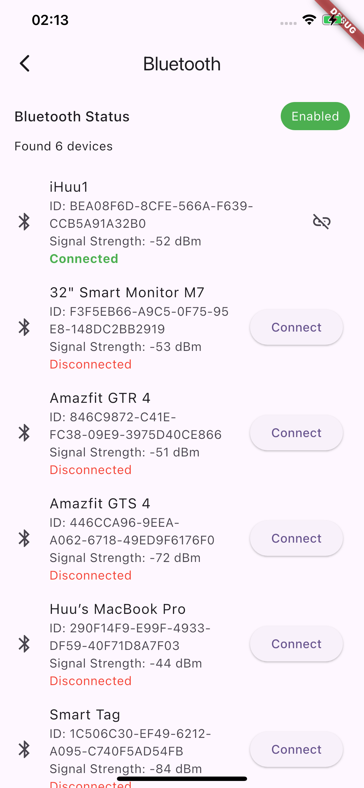
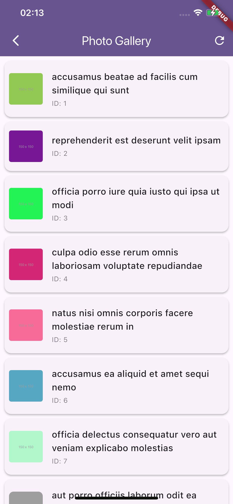

# Flutter Code Challenge - Photo Gallery & Bluetooth Device Management

**Flutter Code Challenge** is a mobile application for managing Bluetooth devices and displaying a paginated photo gallery.

Submitted by: Hoang Duc Huu

Time spent: **2** weeks spent in total


## User Stories

* [x] **Photo Gallery**
    * [x] Paginated photo loading (100 items per page)
    * [x] Pull-to-refresh functionality
    * [x] Loading states and error handling
    * [x] Image caching for better performance

* [x] **Bluetooth Management**
    * [x] Device scanning and filtering
        * [x] Filter by signal strength (RSSI > -90)
        * [x] Auto-refresh device list
    * [x] Connection handling
        * [x] Connect/disconnect devices
        * [x] Track connection states
        * [x] Handle timeouts

The following **additional** features are implemented:
* [x] Switchable Bluetooth implementations (flutter_blue_plus/flutter_reactive_ble)
* [ ] Local device storage using Isar database
* [x] Custom device filtering and sorting
* [x] Comprehensive test coverage

## Features Showcase

|                                      Bluetooth Scanner                                       |                                Photo Gallery                                |
|:--------------------------------------------------------------------------------------------:|:---------------------------------------------------------------------------:|
| Scan, filter, and connect to Bluetooth devices<br>Support multiple Bluetooth implementations | Paginated photo gallery with caching<br>Pull-to-refresh and infinite scroll |
|                                         |                            |
|                 [Watch Demo ▶️](https://www.youtube.com/shorts/XISVASTE5vo)                  |         [Watch Demo ▶️](https://www.youtube.com/shorts/R6mn7qr-kCo)         |

## Project Structure
```
lib/
├── config.dart                              # Global configuration
├── core/                                   # Core utilities
│   ├── di/                                 # Dependency injection
│   └── network/                            # Network client
├── data/                                   # Data layer
│   ├── database/                           # Local storage
│   ├── local/                              # Local data sources
│   └── repository/                         # Repository implementations
├── domain/                                 # Business logic layer
│   ├── bluetooth_repository.dart
│   └── photo_repository.dart
├── models/                                 # Data models
├── navigation/                             # Routing
├── presentation/                           # UI layer
│   ├── screen/                             # App screens
│   │   ├── bluetooth/                      # Bluetooth features
│   │   │   ├── bluetooth_screen.dart
│   │   │   └── provider/
│   │   │       └── bluetooth_provider.dart
│   │   └── photos/                         # Photo gallery features
│   │       ├── photos_screen.dart
│   │       └── provider/
│   │           └── photo_provider.dart
│   └── widget/                             # Shared widgets
├── service/                                # Service implementations
│   └── bluetooth/                          # Bluetooth implementations
└── utils/                                  # Utility functions
```

Key folders:
- **core/**: Contains dependency injection setup and network client
- **data/**: Handles data operations and storage
- **domain/**: Contains business logic and repository interfaces
- **presentation/**: UI components and state management
- **service/**: Service-specific implementations


## Setup Instructions

1. Clone and install dependencies:
```bash
git clone https://github.com/hoangduchuu/Code-Challenge.git
cd Code-Challenge
flutter pub get
```

2. Run the app:
```bash
flutter run
```

## Bluetooth Configuration

Toggle between Bluetooth implementations using the config file:
```dart
// config.dart
const bool useReactiveBle = false; // Use flutter_blue_plus
// const bool useReactiveBle = true; // Use flutter_reactive_ble
```

## Testing Coverage

* [x] **Photo Gallery Tests**
    * Pagination functionality
    * Loading states
    * Error handling

* [x] **Bluetooth Tests**
    * Device discovery and filtering
    * Implementation-specific tests
    * Mock service tests

## Open-source libraries used

- [flutter_reactive_ble: ^5.3.1](https://pub.dev/packages/flutter_reactive_ble) - Alternative Bluetooth implementation
- [flutter_blue_plus: ^1.34.5](https://pub.dev/packages/flutter_blue_plus) - Default Bluetooth implementation
- [provider: ^6.1.2](https://pub.dev/packages/provider) - State management
- [get_it: ^8.0.2](https://pub.dev/packages/get_it) - Dependency injection
- [dio: ^5.7.0](https://pub.dev/packages/dio) - Network requests
- [isar: ^3.1.0+1](https://pub.dev/packages/isar) - Local database
- [cached_network_image: ^3.4.1](https://pub.dev/packages/cached_network_image) - Image caching

## License

    Copyright [2024] [Hoang Duc Huu]

    Licensed under the Apache License, Version 2.0 (the "License");
    you may not use this file except in compliance with the License.
    You may obtain a copy of the License at

        http://www.apache.org/licenses/LICENSE-2.0

    Unless required by applicable law or agreed to in writing, software
    distributed under the License is distributed on an "AS IS" BASIS,
    WITHOUT WARRANTIES OR CONDITIONS OF ANY KIND, either express or implied.
    See the License for the specific language governing permissions and
    limitations under the License.
